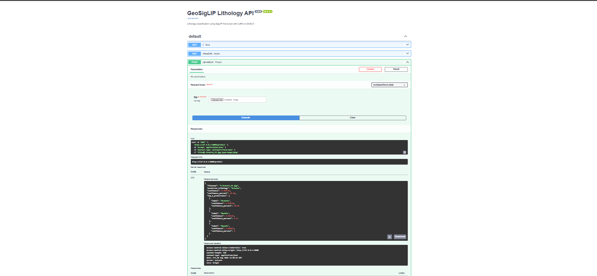

<div align="center">

# GeoSigLIP

### Fine-Tuned Vision Model for Lithology Classification

<p>
  <strong>Domain-adapted geological image classification with SigLIP + LoRA</strong>
</p>

<p>
  <a href="https://github.com/UtkarshRode/GeoSigLIP-Fine-Tuned-Vision-Model-for-Lithology-Classification">
    
  </a>
  
  
  
  
  
</p>

<p>
  
  
  
  
</p>

</div>

---

## 🧠 What is GeoSigLIP?

**GeoSigLIP** is an end-to-end geological image classification project that adapts Google's pretrained **SigLIP** vision-language model to domain-specific lithology recognition using **parameter-efficient LoRA fine-tuning**.

Instead of training a vision model from scratch, the project starts from a pretrained multimodal representation and adapts selected transformer projections for geological imagery. The resulting model is evaluated against a genuine zero-shot SigLIP baseline and then exposed through a **FastAPI inference service** and a **React web application**.

### The project in one line

> **Pretrained SigLIP → LoRA domain adaptation → rigorous evaluation → deployable inference application**

---

## 🎯 Project Highlights

| Area | Implementation |
|:--|:--|
| **Base model** | `google/siglip-base-patch16-224` |
| **Fine-tuning** | LoRA / Parameter-Efficient Fine-Tuning |
| **LoRA targets** | `q_proj`, `v_proj` |
| **LoRA rank** | 16 |
| **LoRA alpha** | 32 |
| **LoRA dropout** | 0.05 |
| **Task** | 7-class lithology classification |
| **Training images** | 2,450 |
| **Validation images** | 1,050 |
| **Held-out test images** | 1,750 |
| **Backend** | FastAPI + PyTorch |
| **Frontend** | React + Vite |
| **Experiment platform** | Kaggle |

---

## 📊 Results

The final model was evaluated on an **untouched 1,750-image test set**.

### Model comparison

| Model | Accuracy | Macro F1 |
|:--|--:|--:|
| SigLIP Zero-Shot | 55.257% | 47.762% |
| **SigLIP + LoRA** | **99.886%** | **99.886%** |

### Improvement from domain adaptation

| Metric | Gain |
|:--|--:|
| Accuracy | **+44.629 percentage points** |
| Macro F1 | **+52.124 percentage points** |

The zero-shot baseline establishes how the pretrained model performs before task-specific adaptation, while the LoRA model measures the benefit of geological domain fine-tuning.

> **Evaluation note:** the very strong fine-tuned result was followed by a dedicated robustness and split-integrity analysis instead of being reported in isolation.

---

## 🧪 Robustness & Data Integrity

The project includes explicit checks for possible split leakage and duplicate imagery.

### Split overlap

```text
Train ∩ Validation = 0
Train ∩ Test       = 0
Validation ∩ Test  = 0
```

### Exact duplicates

SHA-256 analysis found:

```text
Cross-split exact duplicates = 0
Conflicting duplicate labels = 0
```

### Visual similarity screening

A strict visual-fingerprint screen reported:

```text
Train → Validation = 0
Train → Test       = 4
Validation → Test  = 0
```

The four high-similarity train/test pairs were manually inspected as part of the robustness workflow.

---

## 🪨 Lithology Classes

GeoSigLIP predicts seven lithology classes:

| ID | Lithology |
|---:|:--|
| 1 | Red sandstone |
| 2 | Light sandstone |
| 3 | Gray siltstone |
| 4 | Mudstone |
| 5 | Granite |
| 6 | Basalt |
| 7 | Marble |

---

## 🔄 End-to-End ML Pipeline

```text
                         Geological Images
                                │
                                ▼
                     Exploratory Data Analysis
                                │
                                ▼
                       SigLIP Zero-Shot
                         Baseline Study
                                │
                                ▼
                     LoRA Domain Fine-Tuning
                                │
                                ▼
                    Validation / Best Checkpoint
                                │
                                ▼
                    Held-Out Test Evaluation
                                │
                 ┌──────────────┴──────────────┐
                 │                             │
                 ▼                             ▼
          Zero-Shot SigLIP              SigLIP + LoRA
                 │                             │
                 └──────────────┬──────────────┘
                                ▼
                     Robustness / Leakage Checks
                                │
                                ▼
                         Trained Checkpoint
                                │
                                ▼
                         FastAPI Inference
                                │
                                ▼
                          React Frontend
                                │
                                ▼
                 Prediction + Confidence + Top-3
```

---

## 🧩 Why LoRA?

The project uses **Low-Rank Adaptation (LoRA)** instead of full-model fine-tuning.

LoRA introduces trainable low-rank updates into selected linear projections while keeping the original pretrained weights frozen.

For GeoSigLIP, adapters were applied to:

```text
vision transformer
├── self_attn.q_proj
└── self_attn.v_proj
```

Configuration:

```text
Rank     = 16
Alpha    = 32
Dropout  = 0.05
```

This provides a parameter-efficient path to domain adaptation while preserving the pretrained representation.

---

## 🖥️ Application

The trained model is wrapped in a full-stack inference application.

### User flow

```text
Upload geological image
          ↓
Image preview
          ↓
Analyze lithology
          ↓
FastAPI /predict
          ↓
GeoSigLIP + LoRA
          ↓
Prediction
          ↓
Confidence + Top-3 alternatives
```

### Application screenshot

<p align="center">
  
</p>

---

## 🔌 API

The backend exposes a simple image-classification endpoint:

```http
POST /predict
```

The endpoint accepts an image and returns:

- predicted lithology
- confidence
- top-3 predictions
- original filename

### API endpoint

<p align="center">
  
</p>

### Example response

<p align="center">
  
</p>

Example response shape:

```json
{
  "filename": "rock.jpg",
  "predicted_lithology": "Granite",
  "confidence": 0.9988,
  "confidence_percent": 99.88,
  "top_k_predictions": [
    {
      "label": "Granite",
      "confidence": 0.9988,
      "confidence_percent": 99.88
    }
  ]
}
```

---

## 📁 Repository Structure

```text
GeoSigLIP/
│
├── backend/
│   ├── main.py
│   └── requirements.txt
│
├── frontend/
│   ├── src/
│   │   ├── App.jsx
│   │   ├── App.css
│   │   └── index.css
│   ├── package.json
│   └── package-lock.json
│
├── model/
│   └── README.md
│
├── data/
│   └── processed/
│
├── notebooks/
│   ├── 00_prepare_kaggle.ipynb
│   ├── 01_eda.ipynb
│   ├── 02_baseline.ipynb
│   ├── 03_finetuning.ipynb
│   ├── 04_final_evaluation.ipynb
│   ├── 05_robustness_analysis.ipynb
│   └── 06_deployment.ipynb
│
├── docs/
│   └── images/
│       ├── app-preview.png
│       ├── api-endpoint.png
│       └── api-result.png
│
├── .gitignore
└── README.md
```

---

## 🧪 Experiment Notebooks

The notebooks preserve the complete experimentation workflow:

| Notebook | Purpose |
|:--|:--|
| `00_prepare_kaggle.ipynb` | Dataset preparation |
| `01_eda.ipynb` | Exploratory data analysis |
| `02_baseline.ipynb` | Baseline / zero-shot experiments |
| `03_finetuning.ipynb` | LoRA fine-tuning |
| `04_final_evaluation.ipynb` | Final held-out evaluation |
| `05_robustness_analysis.ipynb` | Duplicate / leakage analysis |
| `06_deployment.ipynb` | Model inference and deployment workflow |

The Kaggle notebooks were used for experimentation and compute, while their notebook copies are included here for reproducibility and inspection.

---

## ⚙️ Local Setup

### 1. Clone the repository

```bash
git clone https://github.com/UtkarshRode/GeoSigLIP-Fine-Tuned-Vision-Model-for-Lithology-Classification.git
cd GeoSigLIP-Fine-Tuned-Vision-Model-for-Lithology-Classification
```

### 2. Backend

Create a Python virtual environment:

```bash
python -m venv .venv
```

Windows:

```bash
.venv\Scriptsctivate
```

Install dependencies:

```bash
pip install -r backend/requirements.txt
```

Place the trained checkpoint at:

```text
model/best_model.pt
```

Start the API:

```bash
uvicorn backend.main:app --reload
```

Open Swagger:

```text
http://127.0.0.1:8000/docs
```

### 3. Frontend

Open a second terminal:

```bash
cd frontend
npm install
npm install lucide-react
npm run dev
```

Open:

```text
http://localhost:5173
```

---

## 🔐 Model Weights

The trained `best_model.pt` checkpoint is **not stored in Git history** because of its size.

The source repository intentionally excludes:

```text
*.pt
*.pth
*.ckpt
*.safetensors
```

The trained checkpoint is maintained separately.

Expected local path:

```text
model/best_model.pt
```

---

## 🛠️ Tech Stack

### Machine Learning


### Backend


### Frontend


### Experimentation


---

## 💡 Engineering Decisions

### Parameter-efficient fine-tuning

LoRA was selected to adapt a pretrained vision-language model without updating the full backbone.

### Meaningful baseline

The project reports a genuine zero-shot SigLIP baseline rather than presenting the fine-tuned model alone.

### Held-out evaluation

A separate 1,750-image test set is reserved for final evaluation.

### Data-integrity analysis

The project checks path overlap, SHA-256 duplicates, conflicting labels, and highly similar images across dataset splits.

### Model serving

Inference is isolated behind a FastAPI endpoint so the frontend remains independent of the model implementation.

### Reusable frontend

The React client communicates with the backend over HTTP and renders the model output in a user-facing interface.

---

## 🚧 Current Deployment Status

> **Public live deployment is not currently hosted.**

The application has been tested end-to-end locally:

```text
React frontend
      ↓
FastAPI backend
      ↓
GeoSigLIP + LoRA
      ↓
Prediction
```

The repository includes the application and API screenshots above as evidence of the working local system.

---

## 🗺️ Roadmap

- [x] Dataset preparation
- [x] Exploratory data analysis
- [x] Zero-shot baseline
- [x] LoRA fine-tuning
- [x] Validation and checkpointing
- [x] Held-out test evaluation
- [x] Robustness analysis
- [x] FastAPI inference
- [x] React frontend
- [x] GitHub repository
- [x] Documentation and screenshots
- [ ] Public deployment

---

## ⚠️ Limitations

GeoSigLIP is trained for the seven lithology classes represented in the project dataset.

Performance on images outside the dataset distribution may differ from the reported benchmark. The model should therefore be treated as an AI-assisted classification system rather than a replacement for professional geological interpretation.

---

## 👤 Author

**Utkarsh Rode**  
IIT Kharagpur

---

<div align="center">

### GeoSigLIP

**Fine-tuned vision intelligence for geological lithology classification.**

</div>
