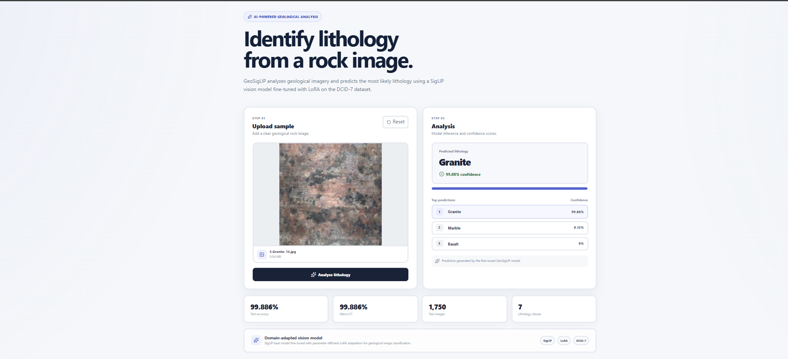

# GeoSigLIP — Fine-Tuned Vision Model for Lithology Classification

<p align="center">
  <strong>Domain-adapted geological image classification with SigLIP + LoRA</strong>
</p>

<p align="center">
  <a href="https://github.com/UtkarshRode/GeoSigLIP-Fine-Tuned-Vision-Model-for-Lithology-Classification">
    
  </a>
  
  
  
  
  
</p>

<p align="center">
  
  
  
  
</p>

---

## 🔬 Overview

**GeoSigLIP** is an end-to-end geological image classification system that adapts Google's pretrained **SigLIP** vision-language model to domain-specific lithology recognition using **parameter-efficient LoRA fine-tuning**.

The project combines model adaptation, held-out evaluation, robustness analysis, and a deployable inference stack built with **FastAPI** and **React**.

> **Core idea:** start from a strong pretrained vision-language model, adapt a small set of parameters to geological imagery, rigorously evaluate the result, and expose the trained model through a usable application.

---

## ✨ Highlights

- 🧠 Fine-tuned `google/siglip-base-patch16-224`
- ⚡ Parameter-efficient **LoRA** adaptation
- 🪨 7-class geological lithology classification
- 📊 Separate train, validation, and held-out test sets
- 🧪 True SigLIP zero-shot baseline
- 📈 Accuracy, precision, recall, Macro F1, and confusion matrices
- 🔎 Exact duplicate and visual-similarity analysis
- 🚀 FastAPI inference API
- 🎨 React web application
- 📌 Top-3 predictions with confidence scores

---

## 🧭 End-to-End Pipeline

```text
                    DCID-7 Geological Images
                              │
                              ▼
                    Exploratory Data Analysis
                              │
                              ▼
                       Zero-Shot SigLIP
                              │
                         Baseline
                              │
                              ▼
                  LoRA Fine-Tuning of SigLIP
                              │
                              ▼
                    Validation / Checkpoint
                              │
                              ▼
                   Held-Out Test Evaluation
                              │
                 ┌────────────┴────────────┐
                 │                         │
                 ▼                         ▼
          Zero-Shot SigLIP          SigLIP + LoRA
                 │                         │
                 └────────────┬────────────┘
                              ▼
                    Robustness Analysis
                              │
                              ▼
                     Trained Checkpoint
                              │
                              ▼
                      FastAPI Backend
                              │
                              ▼
                       React Frontend
                              │
                              ▼
                Lithology + Confidence + Top-3
```

---

## 📈 Final Results

Evaluation was performed on a **held-out test set of 1,750 images**.

| Model | Accuracy | Macro F1 |
|:--|--:|--:|
| SigLIP Zero-Shot | 55.257% | 47.762% |
| **SigLIP + LoRA** | **99.886%** | **99.886%** |

### Improvement

| Metric | Improvement |
|:--|--:|
| Accuracy | **+44.629 percentage points** |
| Macro F1 | **+52.124 percentage points** |

The zero-shot baseline uses SigLIP image-text representations, while the fine-tuned model uses the learned classification head after LoRA adaptation.

> **Note:** the unusually strong test result was followed by dedicated data-integrity and similarity checks rather than being treated as sufficient on its own.

---

## 🧪 Robustness & Data Integrity

### Split overlap

```text
Train ∩ Validation = 0
Train ∩ Test       = 0
Validation ∩ Test  = 0
```

### Exact duplicate detection

SHA-256 hashing found:

```text
Cross-split exact duplicates = 0
Conflicting duplicate labels = 0
```

### Visual similarity screening

A strict visual-fingerprint screen found:

```text
Train → Validation = 0
Train → Test       = 4
Validation → Test  = 0
```

The four train-test pairs were manually inspected as part of the robustness workflow.

---

## 🪨 Lithology Classes

The classifier predicts:

1. Red sandstone
2. Light sandstone
3. Gray siltstone
4. Mudstone
5. Granite
6. Basalt
7. Marble

---

## 🧠 Model Configuration

**Base model**

```text
google/siglip-base-patch16-224
```

**LoRA configuration**

```text
Rank:            16
Alpha:           32
Dropout:         0.05
Target modules:  q_proj, v_proj
```

The pretrained backbone is largely frozen while low-rank adapters provide task-specific adaptation.

---

## 📦 Dataset

| Split | Images |
|:--|--:|
| Train | 2,450 |
| Validation | 1,050 |
| Test | 1,750 |
| **Total** | **5,250** |

The test set was reserved for final evaluation and was not used for training or model selection.

---

## 🖥️ Application

GeoSigLIP is exposed through a full-stack inference application.

### Frontend

- React
- Vite
- JavaScript
- CSS
- Lucide React

### Backend

- FastAPI
- Uvicorn
- PyTorch
- Hugging Face Transformers
- Pillow

### Prediction flow

```text
Upload image
      ↓
FastAPI /predict
      ↓
Image preprocessing
      ↓
SigLIP + LoRA
      ↓
Classification head
      ↓
Predicted lithology
      ↓
Confidence + Top-3
```

---

## 🎥 Live Demo

**Live public deployment:** `Coming soon`

The application has been tested end-to-end locally.

| Component | Local URL |
|:--|:--|
| React frontend | `http://localhost:5173` |
| FastAPI API | `http://127.0.0.1:8000` |
| Swagger docs | `http://127.0.0.1:8000/docs` |

> A public live-demo link will be added after production deployment.

### Example inference

```text
Input: geological rock image

Prediction:
Granite

Confidence:
99.88%

Top predictions:
1. Granite
2. Marble
3. Basalt
```

---

## 🖼️ UI Preview

After adding a screenshot to the repository, use:

```markdown

```

Recommended structure:

```text
docs/
└── images/
    └── app-preview.png
```

---

## 🗂️ Project Structure

```text
GeoSigLIP/
│
├── backend/
│   ├── main.py
│   └── requirements.txt
│
├── frontend/
│   ├── src/
│   │   ├── App.jsx
│   │   ├── App.css
│   │   └── index.css
│   ├── package.json
│   └── ...
│
├── model/
│   └── README.md
│
├── data/
│   └── processed/
│
├── notebooks/
│   ├── 00_prepare_kaggle.ipynb
│   ├── 01_eda.ipynb
│   ├── 02_baseline.ipynb
│   ├── 03_finetuning.ipynb
│   ├── 04_final_evaluation.ipynb
│   ├── 05_robustness_analysis.ipynb
│   └── 06_deployment.ipynb
│
├── .gitignore
└── README.md
```

---

## 🧪 Experiment Workflow

| Notebook | Purpose |
|:--|:--|
| `00_prepare_kaggle.ipynb` | Dataset preparation |
| `01_eda.ipynb` | Exploratory data analysis |
| `02_baseline.ipynb` | Baseline / zero-shot experiments |
| `03_finetuning.ipynb` | LoRA fine-tuning |
| `04_final_evaluation.ipynb` | Held-out test evaluation |
| `05_robustness_analysis.ipynb` | Duplicate and leakage checks |
| `06_deployment.ipynb` | Inference/deployment workflow |

---

## 🚀 Quick Start

### Backend

```bash
python -m venv .venv
```

Windows:

```bash
.venv\Scripts\activate
```

Install dependencies:

```bash
pip install -r backend/requirements.txt
```

Place the trained checkpoint at:

```text
model/best_model.pt
```

Start the API:

```bash
uvicorn backend.main:app --reload
```

Open Swagger:

```text
http://127.0.0.1:8000/docs
```

### Frontend

Open a second terminal:

```bash
cd frontend
npm install
npm install lucide-react
npm run dev
```

Open:

```text
http://localhost:5173
```

---

## 🔐 Model Weights

The trained checkpoint is intentionally **not committed to Git history** because of its size.

Expected local path:

```text
model/best_model.pt
```

The model weights are maintained separately from the source repository.

---

## 🧰 Tech Stack

### Machine Learning

`Python` · `PyTorch` · `Hugging Face Transformers` · `SigLIP` · `LoRA` · `NumPy` · `Pandas` · `Pillow`

### Backend

`FastAPI` · `Uvicorn`

### Frontend

`React` · `Vite` · `JavaScript` · `CSS` · `Lucide React`

### Experimentation

`Kaggle` · `Jupyter` · `Confusion Matrices` · `SHA-256` · `Visual Similarity Screening`

---

## 🧩 Engineering Highlights

### Parameter-efficient adaptation

LoRA adapters are applied to selected transformer projection layers instead of updating the full pretrained model.

### Reproducible evaluation

The workflow maintains distinct train, validation, and test splits and reports multiple evaluation metrics.

### Meaningful baseline

Performance is compared against a genuine zero-shot SigLIP setup rather than only reporting the fine-tuned model.

### Robustness checks

The dataset is checked for duplicate paths, exact image duplicates, label conflicts, and highly similar images across splits.

### Production-oriented inference

The trained model is separated from the experimentation notebooks and exposed through an API that can be consumed by a web client.

---

## 🗺️ Roadmap

- [x] Dataset preparation
- [x] Exploratory data analysis
- [x] Zero-shot baseline
- [x] LoRA fine-tuning
- [x] Held-out test evaluation
- [x] Robustness analysis
- [x] FastAPI inference
- [x] React application
- [ ] Add public live demo
- [ ] Production deployment
- [ ] Add demo GIF / final screenshots

---

## ⚠️ Limitations

The model predicts only the seven lithology classes represented in this project.

Performance on images outside the training distribution may differ substantially from the reported benchmark. Predictions should be treated as AI-assisted classification rather than a replacement for professional geological interpretation.

---

## 👤 Author

**Utkarsh Rode**

**Project:** GeoSigLIP — Fine-Tuned Vision Model for Lithology Classification

---

<p align="center">
  <strong>GeoSigLIP</strong><br>
  Fine-tuned vision model for geological lithology classification.
</p>
